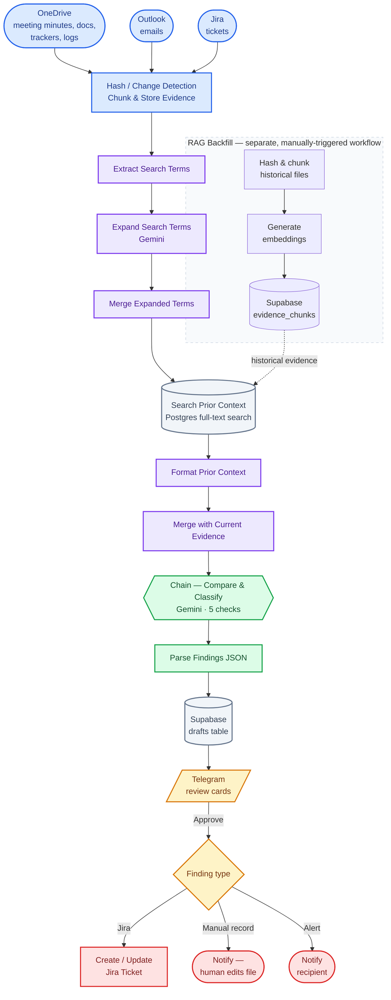

# Project360 — System Architecture

How the pieces fit together, and where a human has to step in before anything real changes.

**Legend:** blue is incoming evidence and evidence processing, purple is the retrieval pipeline, green is where Gemini reasons over the evidence, grey cylinders are persistent storage, yellow is where a human has to approve, and red is where an approved finding can cause an external change.

## What each piece actually does

**Evidence Sources** *(blue)* — OneDrive, Outlook, and Jira provide the current project evidence. Evidence is hashed for change detection, chunked, and stored so it can be retained as project history. Meeting minutes and emails are reprocessed when they change; Jira, trackers, logs, and status reports remain available for comparison on every run because they are structured project records the reasoning step needs to check.

**Retrieval** *(purple)* — search terms are extracted from the current evidence and expanded with Gemini before PostgreSQL full-text keyword search retrieves relevant historical chunks. The current retrieval path is **keyword search, not embedding search**. It returns up to 10 relevant historical chunks, capped at 1,500 characters each.

**Reasoning** *(green)* — Gemini compares the current evidence with retrieved history through five checks:

1. Account for commitments made in meetings and emails.
2. Check each Jira ticket against the evidence.
3. Check tracker and log records, including record-vs-record contradictions.
4. Compare historical context with what is happening now.
5. Check historical context for internal contradictions.

A final structural checklist verifies that findings are fully sourced and contain the required fields before they are written to the drafts table.

**Human approval** *(yellow → red)* — every finding is presented in Telegram and requires explicit human approval. Approved Jira findings can create or update tickets. Findings involving Word or Excel records are routed for manual editing. Alerts notify the relevant recipient.

**RAG Backfill** *(dashed box)* — a separate, manually triggered workflow used to populate historical evidence. Historical files are hashed, chunked, embedded, and stored in Supabase.

The embedding field remains part of the evidence store, but **Project360 does not use embeddings during its normal workflow**. New or changed evidence still goes through hashing, change detection, chunking, and storage, but its embedding field can remain NULL because the active retrieval path uses PostgreSQL full-text keyword search.

## One decision worth calling out

Embeddings were tested against keyword retrieval using the project evidence. Embeddings returned semantically related but often less useful content, particularly around signatures, headers, and generic text. PostgreSQL keyword search performed better on the structured, tracker-heavy evidence used in testing, so it became the active retrieval method.

The embeddings generated during the initial RAG backfill are retained in Supabase rather than being removed, leaving the option to revisit vector retrieval later.

## Why the reminder system is not here

A reminder and re-escalation system was built and tested, but live testing showed that much of its output duplicated issues the main pipeline was already detecting.

It was removed rather than adding another layer of infrastructure without demonstrated value. The development history is documented in `debugging-log.md`.

## What this doesn't solve yet

* **Current evidence is still processed broadly on each run.** Historical evidence is bounded through retrieval, but incremental processing of current evidence has not yet been implemented.
* **Alerts are not tracked to resolution.** The current workflow notifies the recipient but does not maintain a full resolution lifecycle.
* **Evaluation is manual.** Findings are currently compared against the fixed evaluation set manually. Automated evaluation would be needed for larger-scale or higher-frequency use.
